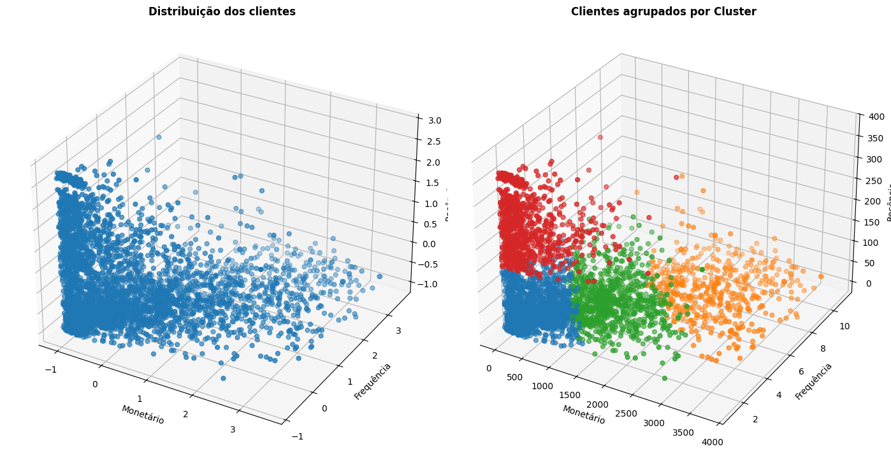
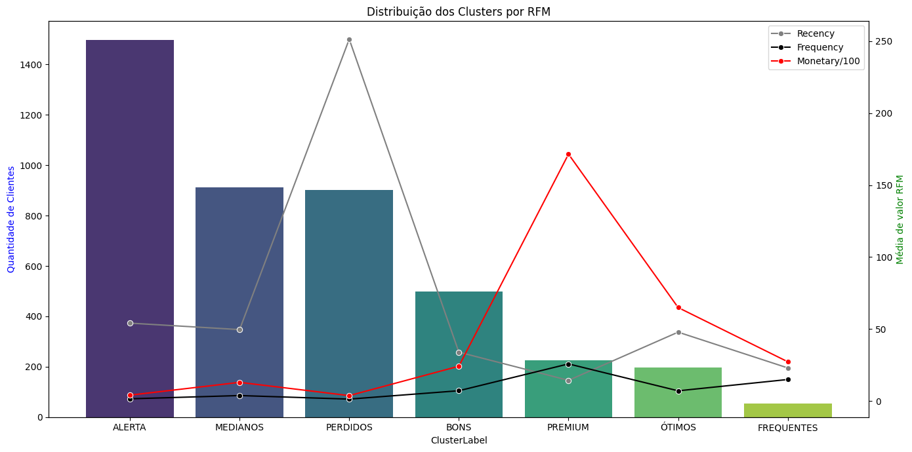
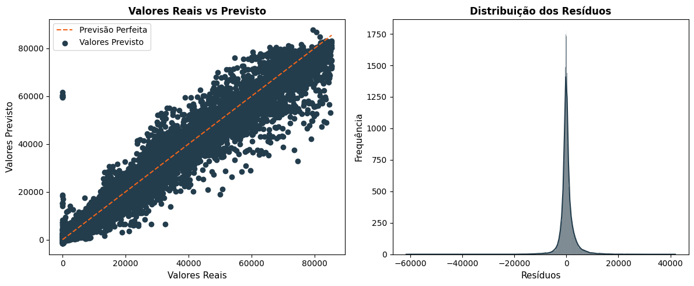
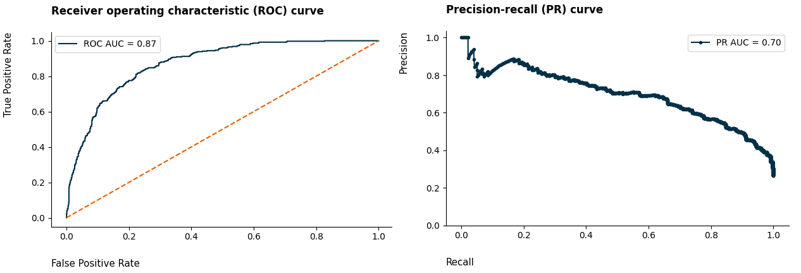

# Portfólio de Ciência de Dados & MLOps

  

## Projetos

### Segmentação de Clientes (Clustering)

Este é um projeto que visa segmentar os clientes em grupos com comportamentos de compras
semelhantes.Utilizei a técnica RFM e Clusterização para a solução. Link direto: https://bit.ly/4hne5Uh

O projeto gerou 3 relatórios analíticos contendo:
1. Clientes agrupados por RFM e seus devidos clusters/grupos.
2. Análise, interpretação e sugestões dos Clusters.
3. Tabela contendo a média dos valores de RFM por cluster.

Segmentação dos Clientes em Clusters: 

Visualização dos Clusters por RFM:

----------------------------------------------

### Previsão de Vendas (Forecast)

Este é um projeto de Regressão e Análise de Série Temporal que visa projetar as vendas de 45
lojas do Walmart para os próximos 3 meses. Link direto: https://bit.ly/48xNu2G

O modelo de Machine Learning construído que captou melhor a tendência de vendas nos feriados de Ação de Graça e Natal foi o LightGBM utilizando a otimização com a biblioteca Optuna. O modelo também conseguiu capturar as tendências de queda no início do ano, apresentando um bom desempenho.

Construí uma margem de erro que garante uma acurácia de 71% nas projeções. O erro do modelo está em torno de 1631.58 unidades de vendas, com uma média de vendas de 15981.25.

Análise dos Resíduos: 

Forecast do Modelo: 

-------------------------------------------------

### Previsão de Cancelamento de Serviço (Churn)

Este é um projeto que possibilita entender a probabilidade de um cliente descontinuar o uso de um serviço. Com essa informação podemos tentar reverter essa possível perda.

O projeto apresenta uma variável target desbalanceada. A métrica de avaliação será **recall > 80%**. A métrica analisa justamente o erro do modelo nos clientes que já cancelaram o serviço anteriormente.

O modelo construído identifica corretamente 82% (recall) dos clientes que cancelaram o serviço.

Comparação do Desempenho dos Modelos baseados em Árvore: 

Métricas ROC AUC e Precision-recall: 

